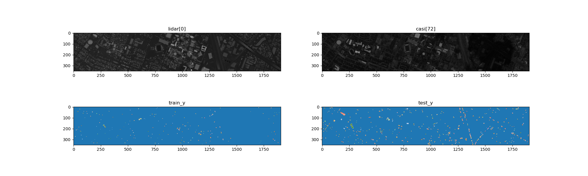

**English** | [中文(简体)](./README.zh-hans.md)

---


**WARNING: The official website of houston2013 has been down since 2024-11-01, and we're not sure if it's a temporary or permanent change. This package will not work if [the official website of houston2013](https://hyperspectral.ee.uh.edu/?page_id=459) is down.**
**UPDATE: I have moved the URL to the new [official website of houston2013](https://machinelearning.ee.uh.edu/?page_id=459)**

This project is still working in progress

---

# fetch_houston2013
Download and load Houston 2013 Dataset (2013 IEEE GRSS Data Fusion Contest) like a buildin function in scikit-learn.

- Automaticlly download all needed files
- Support caching
- Verify checksums
- Show copyright of the dataset
- numpy format
- PyTorch support
- Use sparse matrix to representing ground truth, less memory usage and easier iteration
- Faster loading than `.mat`
- Need more testing before GA



# fetch_muufl
fetch_muufl dataset

## Usage
1. Install scikit-image
```bash
pip install scikit-image==0.22.0
pip install scipy
```
2. copy [fetch_houston2013.py](fetch_houston2013/fetch_houston2013.py) to your project
3. import and run
```python
from fetch_houston2013 import fetch_houston2013
casi, lidar, train_y, test_y, info = fetch_houston2013()
```

### PyTorch
1. Install scikit-image
```bash
pip install scikit-image==0.22.0
pip install scipy
```
2. copy [Houston2013.py](houston2013/Houston2013.py) to your project
3. import and run
```python
from Houston2013 import Houston2013
trainset = DataLoader(Houston2013(train=True, patch_size=7), batch_size=32, shuffle=True)
testset  = DataLoader(Houston2013(train=False, patch_size=7))
```
## Troubleshooting
Remove `~/scikit_learn_data` to clean cache and try again.  
We download dataset from official website and pastbin.com. Make sure you can access these websites.

## Benchmark

In our simple test case, loading data is nearly 2x faster than traditional ways, thanks to the native code in `imageio`.

```python
In [4]: from util.houton2013 import fetch_houston2013
   ...: from time import time
   ...: start_time = time()
   ...: fetch_houston2013()
   ...: print("fetch_houston2013 %.4f ms"  % (1000*(time() - start_time)))

fetch_houston2013 521.4026 ms

In [5]: from scipy.io import loadmat
   ...: start_time = time()
   ...: loadmat(os.path.expanduser('~/dataset/Houston2013/HSI.mat'))['HSI']
   ...: loadmat(os.path.expanduser('~/dataset/Houston2013/DSM.mat'))['DSM']
   ...: loadmat(os.path.expanduser('~/dataset/Houston2013/TR.mat'))['TR_map']
   ...: loadmat(os.path.expanduser('~/dataset/Houston2013/TE.mat'))['TE_map']
   ...: print("loadmat Time %.4f ms" % (1000*(time() - start_time)))

loadmat Time 979.6755 ms
```

Test environmetn: `Ubuntu 22.04 on Intel(R) Core(TM) i9-10900X`

## This is totally meaningless!
Yes, comparing to training time, improving data loading time is not notable, but it is interesting.

## TODO(Maybe)
Replace scikit-image with imageio
Publish to pypi or provide whl

## Credits
Houston2013 dataset: https://hyperspectral.ee.uh.edu/?page_id=459  
paperswithcode: https://paperswithcode.com/dataset/houston  
The 2013_IEEE_GRSS_DF_Contest_Samples_VA.txt in this repo is exported from original 2013_IEEE_GRSS_DF_Contest_Samples_VA.roi.

```text
Note: If this data is used in any publication or presentation the following reference must be cited:
P. Gader, A. Zare, R. Close, J. Aitken, G. Tuell, “MUUFL Gulfport Hyperspectral and LiDAR Airborne Data Set,” University of Florida, Gainesville, FL, Tech. Rep. REP-2013-570, Oct. 2013.
If the scene labels are used in any publication or presentation, the following reference must be cited:
X. Du and A. Zare, “Technical Report: Scene Label Ground Truth Map for MUUFL Gulfport Data Set,” University of Florida, Gainesville, FL, Tech. Rep. 20170417, Apr. 2017. Available: http://ufdc.ufl.edu/IR00009711/00001.
If any of this scoring or detection code is used in any publication or presentation, the following reference must be cited:
T. Glenn, A. Zare, P. Gader, D. Dranishnikov. (2016). Bullwinkle: Scoring Code for Sub-pixel Targets (Version 1.0) [Software]. Available from https://github.com/GatorSense/MUUFLGulfport/.
```

## License
AGPL-3.0-only
