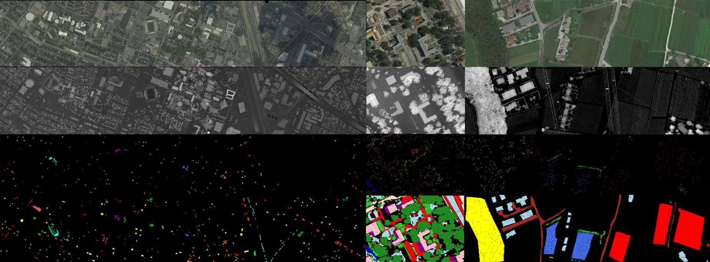

# fetch houston2013 muufl and trento

[](https://pypi.org/project/fetch-houston2013)
[](https://pypi.org/project/fetch-houston2013)

Download and load Houston 2013 Dataset, Trento dataset and Muufl dataset easily and swiftly.

- Automatically download and cache all needed files
- Verify checksums to avoid data poisoning
- Use sparse matrix to representing ground truth, less memory usage and easier iteration



## Usage
1. install this package
```bash
pip install fetch-houston2013
```
2. import and get the dataset
```python
from fetch_houston2013 import fetch_houston2013, fetch_muufl, fetch_trento, split_spmatrix
# For Houston 2013
hsi, dsm, train_label, test_label, info = fetch_houston2013()
# For Muufl
casi, lidar, truth, info = fetch_muufl()
train_label, test_label = split_spmatrix(truth, 20)
# For Trento
casi, lidar, truth, info = fetch_trento()
train_label, test_label = split_spmatrix(truth, 20)
```
3. tips: train_label and test_label are [sparse matrix](https://docs.scipy.org/doc/scipy/reference/generated/scipy.sparse.coo_array.html), you can either convert them to np.array easily by
```python
train_label=train_label.todense()
test_label =test_label.todense()
```
or directly use them for getting the value in a very fast way:
```python
    def __getitem__(self, index):
      i = self.truth.row[index]
      j = self.truth.col[index]
      label = self.truth.data[index].item()
      x_hsi = self.hsi[:, i, j]
      x_dsm = self.dsm[:, i, j]
      return x_hsi, x_dsm, label
```

## Help
- [GitHub Wiki](https://github.com/songyz2019/fetch_houston2013/wiki)

1. Remove `~/scikit_learn_data` to clean cache and try again.  
2. We download dataset from official website and pastbin.com. Make sure you can access these websites.

## Build
1. Install [uv](https://docs.astral.sh/uv/)
2. Run `uv build` to build `.whl`
3. Run `uv run python tests/test.py` to test the package.

## Experimental Features
### torch
Since 0.6, a new torch dataset is under testing, the API is under designing, you can try it:
```python
from fetch_houston2013.torch import Houston2013, Trento, Muufl
dataset = Muufl(subset='train')
x_h, x_l, y, extras = dataset[0]
```
### util.lbl2rgb
Since 0.6, a label-to-rgb util is introduced, it's under development
```python
from fetch_houston2013.util import lbl2rgb
hsi, dsm, train_label, test_label, info = fetch_houston2013()
lbl2rgb(test_label, 'houston2013')
```

## Star History

[](https://www.star-history.com/#songyz2019/fetch_houston2013&Date)

## Contribution
We welcome all contributions, including issues, pull requests, feature requests and discussions.

## Credits
```text
Houston2013 dataset: https://machinelearning.ee.uh.edu/?page_id=459
paperswithcode: https://paperswithcode.com/dataset/houston
Muufl dataset: https://github.com/GatorSense/MUUFLGulfport
Dafault url of Trento dataset is https://github.com/tyust-dayu/Trento/tree/b4afc449ce5d6936ddc04fe267d86f9f35536afd
The 2013_IEEE_GRSS_DF_Contest_Samples_VA.txt in this repo is exported from original 2013_IEEE_GRSS_DF_Contest_Samples_VA.roi.
Note: If this data is used in any publication or presentation the following reference must be cited:
P. Gader, A. Zare, R. Close, J. Aitken, G. Tuell, “MUUFL Gulfport Hyperspectral and LiDAR Airborne Data Set,” University of Florida, Gainesville, FL, Tech. Rep. REP-2013-570, Oct. 2013.
If the scene labels are used in any publication or presentation, the following reference must be cited:
X. Du and A. Zare, “Technical Report: Scene Label Ground Truth Map for MUUFL Gulfport Data Set,” University of Florida, Gainesville, FL, Tech. Rep. 20170417, Apr. 2017. Available: http://ufdc.ufl.edu/IR00009711/00001.
If any of this scoring or detection code is used in any publication or presentation, the following reference must be cited:
T. Glenn, A. Zare, P. Gader, D. Dranishnikov. (2016). Bullwinkle: Scoring Code for Sub-pixel Targets (Version 1.0) [Software]. Available from https://github.com/GatorSense/MUUFLGulfport/.
```

## License
```text
Copyright 2025 songyz2023

Licensed under the Apache License, Version 2.0 (the "License");
you may not use this file except in compliance with the License.
You may obtain a copy of the License at

http://www.apache.org/licenses/LICENSE-2.0

Unless required by applicable law or agreed to in writing, software
distributed under the License is distributed on an "AS IS" BASIS,
WITHOUT WARRANTIES OR CONDITIONS OF ANY KIND, either express or implied.
See the License for the specific language governing permissions and
limitations under the License.
```